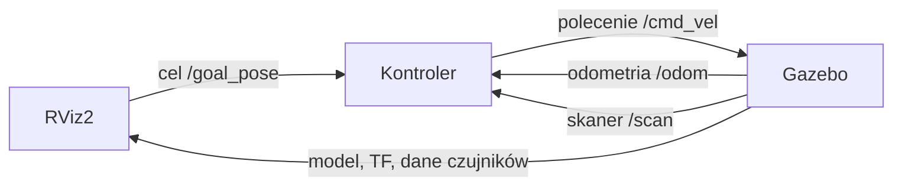

# Śledzenie trajektorii TurtleBot3 w ROS 2

## 1. Informacje organizacyjne

### Cel ćwiczenia

Celem ćwiczenia jest pierwsze praktyczne użycie systemu ROS 2 do sterowania robotem mobilnym w symulacji. W trakcie zajęć uruchomisz model TurtleBot3 Burger w symulatorze Gazebo, obejrzysz jego dane w RViz2 oraz napiszesz w C++ fragmenty programu realizującego śledzenie zadanej trajektorii.

Po wykonaniu ćwiczenia powinieneś umieć:

- wyjaśnić rolę węzłów, tematów, wiadomości i układów współrzędnych w ROS 2;
- uruchomić symulację robota w Gazebo i wizualizację w RViz2;
- użyć podstawowych poleceń `ros2`;
- zbudować pakiet ROS 2 za pomocą `colcon`;
- zidentyfikować dane wejściowe i wyjściowe węzła ROS 2;
- opublikować polecenie prędkości robota typu `geometry_msgs/msg/Twist`;
- uzupełnić i przetestować regulator śledzenia trajektorii.

### Wymagania wstępne

Ćwiczenie zakłada podstawową znajomość języka C++: zmiennych, instrukcji warunkowych, pętli, funkcji, klas oraz kompilacji programu. Nie jest wymagana wcześniejsza znajomość ROS, Linuxa, Gazebo ani RViz2.

Stanowisko laboratoryjne jest przygotowane przez prowadzącego. Część „Instalacja na własnym komputerze” jest potrzebna wyłącznie osobom, które chcą kontynuować pracę poza laboratorium.

### Czas i przebieg

Na ćwiczenie przewidziano 4 godziny i 15 minut. Najpierw wykonaj część wprowadzającą do ROS 2 i symulacji, a następnie rozpocznij pracę nad szablonem programu.

Zadania są uporządkowane od podstawowych do trudniejszych. Za uruchomienie środowiska i wykonanie części wprowadzającej można uzyskać punkty bez modyfikowania kodu. Nieukończone zadania programistyczne można dokończyć poza zajęciami.

### Oczekiwany rezultat

Po uruchomieniu kompletnego rozwiązania robot powinien:

1. otrzymać cel wskazany w RViz2;
2. śledzić zaprogramowaną trajektorię prowadzącą do tego celu;
3. po zakończeniu trajektorii ustawić się dokładnie w punkcie docelowym;
4. w wersji dodatkowej reagować na przeszkodę wykrytą przez skaner laserowy.

## 2. Punktacja i zasady oddawania

Za wykonanie ćwiczenia można uzyskać maksymalnie **13 punktów**. Punkty przyznawane są za działające rozwiązanie pokazane prowadzącemu oraz za kod przesłany na platformę zajęć.

| Zadanie | Punkty | Warunek uzyskania punktów |
| --- | ---: | --- |
| Uruchomienie środowiska i podstawy ROS 2 | 1 | Uruchomiona symulacja TurtleBot3 w Gazebo, RViz2 oraz wykonanie poleceń z części wprowadzającej. |
| Śledzenie trajektorii: poprawne dane wejściowe i wyjściowe | 2 | Węzeł odbiera pozycję robota oraz cel, wyznacza trajektorię i publikuje polecenia na `/cmd_vel`. |
| Śledzenie trajektorii: implementacja regulatora | 3 | Uzupełniony regulator oblicza prędkość liniową i kątową z wykorzystaniem błędów położenia oraz orientacji. |
| Śledzenie trajektorii: działanie w symulacji | 1 | Robot po wskazaniu celu w RViz2 podąża za wyświetloną trajektorią. |
| Stabilizacja w punkcie docelowym | 4 | Po zakończeniu trajektorii robot dojeżdża do celu i ustawia docelową orientację. |
| Unikanie kolizji | 2 | Robot reaguje na przeszkodę wykrytą przez `/scan`, nie kontynuując ruchu w kierunku kolizji. |

Zadanie unikania kolizji jest zadaniem dodatkowym, przeznaczonym dla osób, które ukończyły wcześniejsze etapy.

Podczas prezentacji rozwiązania prowadzący może poprosić o:

- wskazanie używanych tematów ROS 2;
- wyjaśnienie znaczenia publikowanej wiadomości `geometry_msgs/msg/Twist`;
- pokazanie działania regulatora dla nowego celu;
- krótkie wyjaśnienie uzupełnionego fragmentu kodu.

Kod należy przesłać na platformę zajęć w terminie określonym przez prowadzącego. Wysyłaj wyłącznie pliki źródłowe i pliki konfiguracji pakietu; nie wysyłaj katalogów `build`, `install` ani `log` tworzonych przez `colcon`.

## 3. Stanowisko laboratoryjne

Stanowisko laboratoryjne jest przygotowane przez prowadzącego. Nie instaluj samodzielnie ROS 2, Gazebo ani dodatkowych pakietów, chyba że prowadzący wyraźnie o to poprosi.

### Co jest dostępne na stanowisku

Na stanowisku znajdują się:

- Ubuntu 24.04 uruchomiony w WSL 2;
- ROS 2 Jazzy;
- Gazebo Harmonic;
- RViz2;
- model TurtleBot3 Burger;
- Visual Studio Code wraz z rozszerzeniami do C++ i ROS;
- repozytorium z szablonem ćwiczenia w przestrzeni roboczej `~/okno_ws`.

### Otwarcie terminala

1. Otwórz menu Start systemu Windows.
2. Uruchom aplikację **Windows PowerShell**.
3. Wpisz poniższe polecenie i naciśnij `Enter`:

	```bash
	wsl
	```

4. Pojawi się terminal Linux. Wszystkie polecenia z instrukcji, o ile nie zaznaczono inaczej, wpisuj w tym terminalu.

### Otwarcie Visual Studio Code

1. W terminalu przejdź do katalogu przestrzeni roboczej ćwiczenia:

	```bash
	cd ~/okno_ws
	```

2. Uruchom VS Code w bieżącym katalogu:

	```bash
	code .
	```

3. Jeżeli po pierwszym uruchomieniu pojawi się pytanie o zaufanie do autorów plików, wybierz **Yes, I trust the authors**.
4. W lewym panelu **Explorer** powinny być widoczne katalogi projektu.

> **Uwaga:** VS Code musi działać w trybie WSL. W lewym dolnym rogu okna powinien znajdować się zielony wskaźnik zawierający napis `WSL: Ubuntu-24.04`.

### Kontrola środowiska

W terminalu wykonaj kolejno poniższe polecenia:

```bash
ros2 --help
```

```bash
gz --help
```

```bash
rviz2 --help
```

Dla każdego polecenia powinien zostać wyświetlony opis dostępnych opcji. Brak komunikatu `command not found` oznacza, że narzędzie jest dostępne.

Jeżeli któreś z poleceń kończy się błędem albo VS Code nie działa w trybie WSL, zgłoś to prowadzącemu przed rozpoczęciem kolejnej części.

## 4. Instalacja na własnym komputerze

Ta część jest potrzebna wyłącznie wtedy, gdy chcesz pracować poza laboratorium. Instrukcja dotyczy systemu Windows 11 z WSL 2, Ubuntu 24.04, ROS 2 Jazzy i Gazebo Harmonic.

> **Uwaga:** instalacja może pobrać kilka GB danych i potrwać kilkadziesiąt minut. Do symulacji potrzebne jest połączenie z Internetem oraz co najmniej 25 GB wolnego miejsca na dysku.

### 4.1. Instalacja WSL i Ubuntu 24.04

1. Otwórz menu Start.
2. Wyszukaj `PowerShell`.
3. Kliknij aplikację prawym przyciskiem myszy i wybierz **Uruchom jako administrator**.
4. Wpisz polecenie:

	```powershell
	wsl --install -d Ubuntu-24.04
	```

5. Po zakończeniu instalacji uruchom ponownie komputer.
6. Otwórz zwykłe okno PowerShell i wpisz:

	```powershell
	wsl
	```

7. Przy pierwszym uruchomieniu Ubuntu utwórz konto użytkownika Linux oraz hasło. Hasło nie będzie widoczne podczas wpisywania. Zapamiętaj je: będzie wymagane przez polecenia rozpoczynające się od `sudo`.

Od tej chwili polecenia z dalszej części wykonuj w terminalu WSL.

### 4.2. Aktualizacja Ubuntu

W terminalu WSL wykonaj:

```bash
sudo apt update
```

```bash
sudo apt full-upgrade -y
```

```bash
sudo apt install -y locales
```

```bash
sudo locale-gen en_US en_US.UTF-8
```

```bash
sudo update-locale LC_ALL=en_US.UTF-8 LANG=en_US.UTF-8
```

Zamknij terminal poleceniem:

```bash
exit
```

Otwórz go ponownie z PowerShella:

```powershell
wsl
```

### 4.3. Dodanie repozytorium ROS 2

W terminalu WSL wykonaj kolejno:

```bash
sudo apt install -y software-properties-common
```

```bash
sudo add-apt-repository universe
```

```bash
sudo apt update && sudo apt install -y curl
```

```bash
export ROS_APT_SOURCE_VERSION=$(curl -s https://api.github.com/repos/ros-infrastructure/ros-apt-source/releases/latest | grep -F "tag_name" | awk -F'"' '{print $4}')
```

```bash
curl -L -o /tmp/ros2-apt-source.deb "https://github.com/ros-infrastructure/ros-apt-source/releases/download/${ROS_APT_SOURCE_VERSION}/ros2-apt-source_${ROS_APT_SOURCE_VERSION}.$(. /etc/os-release && echo ${UBUNTU_CODENAME:-${VERSION_CODENAME}})_all.deb"
```

```bash
sudo dpkg -i /tmp/ros2-apt-source.deb
```

```bash
sudo apt update
```

### 4.4. Instalacja ROS 2 i narzędzi programistycznych

Zainstaluj środowisko ROS 2 Jazzy, RViz2 oraz narzędzia potrzebne do budowania pakietów:

```bash
sudo apt install -y ros-jazzy-desktop ros-dev-tools git
```

Dodaj ROS 2 do konfiguracji każdej nowej sesji terminala:

```bash
echo 'source /opt/ros/jazzy/setup.bash' >> ~/.bashrc
```

```bash
source ~/.bashrc
```

Sprawdź instalację:

```bash
ros2 --help
```

Powinien pojawić się opis polecenia `ros2`.

### 4.5. Instalacja Gazebo i TurtleBot3

Zainstaluj pakiety TurtleBot3 oraz integrację ROS 2 z Gazebo:

```bash
sudo apt install -y ros-$ROS_DISTRO-turtlebot3 ros-$ROS_DISTRO-turtlebot3-msgs ros-$ROS_DISTRO-turtlebot3-bringup
```

```bash
sudo apt install -y ros-${ROS_DISTRO}-ros-gz
```

```bash
sudo apt install -y ros-jazzy-turtlebot3-gazebo
```

W ćwiczeniu używany jest model TurtleBot3 Burger. Ustaw go dla każdej nowej sesji terminala:

```bash
echo 'export TURTLEBOT3_MODEL=burger' >> ~/.bashrc
```

```bash
source ~/.bashrc
```

### 4.6. Pobranie materiałów ćwiczenia

Utwórz przestrzeń roboczą ROS 2 i przejdź do katalogu na pakiety źródłowe:

```bash
mkdir -p ~/okno_ws/src
```

```bash
cd ~/okno_ws/src
```

Pobierz repozytorium ćwiczenia wraz z submodułami:

```bash
git clone --recurse-submodules https://github.com/piotrdusz/okno_robm.git
```

Pakiet `teleop_panel` jest dostarczany jako submoduł repozytorium. Gdyby repozytorium zostało wcześniej pobrane bez opcji `--recurse-submodules`, przejdź do jego katalogu i wykonaj:

```bash
cd ~/okno_ws/src/okno_robm
```

```bash
git submodule update --init --recursive
```

### 4.7. Test symulacji

Uruchom symulację:

```bash
ros2 launch turtlebot3_gazebo turtlebot3_world.launch.py
```

Po kilku sekundach powinno pojawić się okno Gazebo z robotem TurtleBot3 Burger. Zakończ symulację, naciskając w terminalu:

```text
Ctrl+C
```

### 4.8. Instalacja Visual Studio Code

1. W systemie Windows pobierz i zainstaluj [Visual Studio Code](https://code.visualstudio.com/).
2. Podczas instalacji zaznacz opcję **Add to PATH**.
3. Uruchom VS Code.
4. Otwórz widok rozszerzeń skrótem `Ctrl+Shift+X`.
5. Zainstaluj rozszerzenia:
	- **WSL** firmy Microsoft;
	- **C/C++** firmy Microsoft;
	- **ROS** firmy Microsoft.

Po instalacji otwórz terminal WSL i sprawdź integrację:

```bash
cd ~/okno_ws
```

```bash
code .
```

Przy pierwszym uruchomieniu VS Code może pobrać składniki potrzebne do pracy w WSL. Po zakończeniu w lewym dolnym rogu okna programu powinien być widoczny wskaźnik `WSL: Ubuntu-24.04`.

## 5. Czym jest ROS 2

ROS 2, czyli *Robot Operating System 2*, nie jest systemem operacyjnym takim jak Windows lub Ubuntu. Jest to zestaw bibliotek, narzędzi i ustalonych zasad komunikacji używanych do tworzenia oprogramowania robotów.

W typowym robocie działają równocześnie programy obsługujące napęd, czujniki, kamerę, nawigację i wizualizację. ROS 2 pozwala tym programom wymieniać dane bez pisania osobnego mechanizmu komunikacji dla każdego z nich.

### 5.1. Węzły

**Węzeł** (*node*) to działający program realizujący jedno, możliwie konkretne zadanie.

Przykłady węzłów użytych w tym ćwiczeniu:

| Węzeł | Zadanie |
| --- | --- |
| Symulacja TurtleBot3 | Symuluje ruch robota, czujniki oraz świat Gazebo. |
| RViz2 | Wyświetla dane robota i umożliwia wskazanie celu. |
| Węzeł śledzenia trajektorii | Odbiera pozycję robota i cel, oblicza prędkość, a następnie steruje robotem. |

Program napisany przez Ciebie będzie jednym węzłem ROS 2. Nie steruje on bezpośrednio silnikami robota. Zamiast tego publikuje polecenie prędkości, które odbiera symulator.

### 5.2. Tematy i wiadomości

**Temat** (*topic*) jest nazwanym kanałem, przez który węzły przesyłają dane. Każdy temat ma określony typ wiadomości.

Węzeł, który wysyła dane, jest **publikatorem** (*publisher*). Węzeł, który odbiera dane, jest **subskrybentem** (*subscriber*).

W ćwiczeniu będą używane między innymi następujące tematy:

| Temat | Kierunek danych | Znaczenie |
| --- | --- | --- |
| `/odom` | robot → program studenta | Aktualna pozycja i prędkość robota wyznaczona z odometrii. |
| `/scan` | robot → program studenta | Odczyty ze skanera laserowego. |
| `/goal_pose` | RViz2 → program studenta | Pozycja i orientacja celu wskazanego myszą. |
| `/cmd_vel` | program studenta → robot | Polecenie prędkości liniowej i kątowej robota. |

Dla przykładu wiadomość typu `geometry_msgs/msg/Twist`, publikowana na `/cmd_vel`, zawiera między innymi:

- `linear.x` – prędkość jazdy do przodu lub do tyłu w metrach na sekundę;
- `angular.z` – prędkość obrotu wokół osi pionowej w radianach na sekundę.

Dla robota poruszającego się po płaskiej powierzchni najczęściej wykorzystuje się tylko te dwa pola.

### 5.3. Pakiety i przestrzeń robocza

**Pakiet** (*package*) jest podstawową jednostką organizacji kodu w ROS 2. Zawiera kod źródłowy, informacje o zależnościach, konfigurację budowania i ewentualne pliki uruchomieniowe.

Własne pakiety przechowuj w katalogu `src` przestrzeni roboczej:

```text
~/okno_ws/
├── src/
│   └── nazwa_pakietu/
├── build/
├── install/
└── log/
```

Katalogi `build`, `install` i `log` powstają automatycznie po zbudowaniu przestrzeni roboczej poleceniem `colcon build`. Kod źródłowy edytuj wyłącznie w `src`.

### 5.4. TF: układy współrzędnych

Robot musi wiedzieć, gdzie znajduje się w świecie oraz gdzie znajdują się jego czujniki. ROS 2 przekazuje takie informacje przez mechanizm **TF** (*transform frames*).

TF przechowuje relacje między nazwanymi układami współrzędnych. Przykładowe układy TurtleBot3:

- `map` – układ globalnej mapy, jeżeli mapa jest używana;
- `odom` – układ odometrii robota;
- `base_footprint` – układ związany z podstawą robota;
- `base_scan` – układ skanera laserowego.

Układ `base_footprint` porusza się razem z robotem. Układ `odom` pozostaje nieruchomy w chwili uruchomienia symulacji. TF pozwala na przykład przeliczyć pozycję celu z układu globalnego na układ robota.

### 5.5. Gazebo i RViz2

Gazebo jest symulatorem. Oblicza fizykę świata, ruch robota, obrót kół oraz wskazania czujników. Po wysłaniu wiadomości na `/cmd_vel` Gazebo sam wyznacza ruch TurtleBot3 i publikuje nowe dane odometrii oraz skanera.

RViz2 nie symuluje fizyki. Jest narzędziem do obserwowania danych ROS 2. W ćwiczeniu posłuży do:

- wyświetlenia modelu robota;
- podglądu układów TF;
- wyświetlenia skanera laserowego i trajektorii;
- wskazania celu dla robota.

### 5.6. Schemat działania ćwiczenia



W kolejnych częściach uruchomisz wszystkie elementy tego schematu, obejrzysz wymieniane wiadomości, a następnie zaimplementujesz węzeł `Kontroler`.

## 6. Uruchomienie TurtleBot3 w Gazebo

W tej części uruchomisz symulację TurtleBot3 Burger. Gazebo będzie symulował świat, ruch robota oraz dane z czujników.

### 6.1. Uruchomienie symulacji

1. Otwórz PowerShell.
2. Uruchom terminal Linux:

	```powershell
	wsl
	```

3. Wybierz model robota używany w ćwiczeniu:

	```bash
	export TURTLEBOT3_MODEL=burger
	```

4. Uruchom symulację:

	```bash
	ros2 launch turtlebot3_gazebo turtlebot3_world.launch.py
	```

5. Poczekaj, aż pojawi się okno Gazebo. Nie zamykaj terminala, z którego uruchomiono polecenie.

W oknie Gazebo powinny być widoczne:

- model TurtleBot3 Burger;
- ściany świata symulacji;
- przeszkody;
- światła oraz siatka podłoża.

> `[Miejsce na zrzut ekranu: uruchomiona symulacja TurtleBot3 Burger w Gazebo]`

### 6.2. Obserwacja symulacji

Gazebo uruchamia symulację w czasie rzeczywistym. Robot początkowo pozostaje nieruchomy, ponieważ żaden węzeł nie publikuje jeszcze poleceń ruchu na temat `/cmd_vel`.

Zwróć uwagę, że robot ma dwa koła napędowe oraz skaner laserowy. Prędkości kół i ich obrót są wyznaczane przez model robota w Gazebo. Twój program będzie publikował wyłącznie prędkość liniową i kątową robota na temat `/cmd_vel`.

### 6.3. Zakończenie symulacji

Aby zakończyć symulację:

1. Kliknij terminal, z którego uruchomiono Gazebo.
2. Naciśnij `Ctrl+C`.
3. Poczekaj, aż okno Gazebo zamknie się.

Nie zamykaj symulacji przyciskiem zamknięcia okna Gazebo. W ten sposób terminal może nadal zawierać działający proces symulacji.

## 7. Wizualizacja i ręczne sterowanie w RViz2

RViz2 służy do obserwowania danych ROS 2 i wskazywania celu. Gotowa konfiguracja używana w ćwiczeniu wyświetla model TurtleBot3, układy TF, dane skanera oraz trajektorię. Zawiera także panel ręcznego sterowania.

### 7.1. Uruchomienie RViz2

Najpierw uruchom symulację Gazebo zgodnie z częścią 6. Nie zamykaj terminala, z którego została uruchomiona.

Otwórz drugi terminal WSL i wykonaj kolejno:

```bash
cd ~/okno_ws/src/okno_robm
```

```bash
rviz2 -d config/okno.rviz
```

Po chwili pojawi się gotowo skonfigurowane okno RViz2.

> `[Miejsce na zrzut ekranu: gotowa konfiguracja RViz2]`

### 7.2. Elementy widoku

W oknie RViz2 zwróć uwagę na:

- model TurtleBot3 Burger;
- osie układów współrzędnych TF;
- punkty skanera laserowego;
- panel **Teleop** do ręcznego sterowania robotem;
- narzędzie **2D Goal Pose** na górnym pasku.

### 7.3. Ręczne sterowanie robotem

Panel **Teleop** publikuje wiadomości typu `geometry_msgs/msg/Twist` na temat `/cmd_vel`.

1. W panelu **Teleop** włącz publikowanie poleceń przyciskiem **Start**.
2. Użyj pola sterowania 2D w panelu.
3. Przesunięcie wskaźnika w górę powoduje jazdę do przodu.
4. Przesunięcie wskaźnika w dół powoduje jazdę do tyłu.
5. Przesunięcie wskaźnika w lewo lub w prawo powoduje skręt robota.
6. Przyciskiem **Stop** zatrzymaj robota.

Obserwuj jednocześnie ruch robota w Gazebo oraz zmianę jego położenia w RViz2.

> **Uwaga:** przed uruchomieniem własnego programu sterującego wyłącz publikowanie w panelu Teleop. Panel i własny program publikujące równocześnie na `/cmd_vel` mogą wydawać robotowi sprzeczne polecenia.

### 7.4. Wskazanie celu

Narzędzie **2D Goal Pose** umożliwia wskazanie pozycji i orientacji celu dla programu śledzenia trajektorii.

1. Kliknij **2D Goal Pose** na górnym pasku RViz2.
2. Kliknij i przytrzymaj lewy przycisk myszy w wybranym punkcie widoku.
3. Przeciągnij kursor w kierunku docelowej orientacji robota.
4. Zwolnij przycisk myszy.

RViz2 opublikuje cel na temat `/goal_pose`. Robot jeszcze nie zareaguje, ponieważ węzeł śledzenia trajektorii zostanie uruchomiony w dalszej części ćwiczenia.

## 8. Podstawowe polecenia ROS 2

W tej części użyjesz terminala do obserwowania uruchomionego systemu ROS 2. Symulacja Gazebo i RViz2 powinny nadal działać.

Otwórz trzeci terminal WSL:

```powershell
wsl
```

### 8.1. Lista węzłów

Wyświetl węzły działające w systemie ROS 2:

```bash
ros2 node list
```

Wynik zawiera nazwy programów uruchomionych przez Gazebo i RViz2. Nazwy mogą być nieco inne w zależności od wersji pakietów.

Aby zobaczyć szczegóły wybranego węzła, najpierw skopiuj jego nazwę z wyniku poprzedniego polecenia, a następnie wykonaj:

```bash
ros2 node info /nazwa_wezla
```

Polecenie wyświetla między innymi tematy publikowane i subskrybowane przez węzeł.

### 8.2. Lista tematów

Wyświetl wszystkie dostępne tematy:

```bash
ros2 topic list
```

Odszukaj na liście co najmniej:

```text
/cmd_vel
/odom
/scan
/tf
```

Sprawdź typ wiadomości publikowanej na temat `/odom`:

```bash
ros2 topic type /odom
```

Wyświetl szczegóły tematu `/cmd_vel`:

```bash
ros2 topic info /cmd_vel --verbose
```

Zwróć uwagę na typ wiadomości oraz liczbę publikatorów i subskrybentów.

### 8.3. Budowa wiadomości

Wyświetl definicję wiadomości polecenia prędkości:

```bash
ros2 interface show geometry_msgs/msg/Twist
```

Odszukaj pola `linear` oraz `angular`. Każde z nich ma typ `Vector3`, który zawiera trzy składowe: `x`, `y` i `z`.

W ćwiczeniu do sterowania robotem będą używane pola:

```text
linear.x
angular.z
```

### 8.4. Podgląd odometrii

Wyświetl jedną wiadomość z tematu odometrii:

```bash
ros2 topic echo /odom --once
```

Odszukaj w wyniku:

```text
pose:
	pose:
		position:
```

Współrzędne `position.x` i `position.y` opisują pozycję robota. Aby zobaczyć ich zmianę, przejedź robotem za pomocą panelu **Teleop** w RViz2, a następnie ponownie wykonaj polecenie.

### 8.5. Podgląd skanera laserowego

Wyświetl jedną wiadomość ze skanera:

```bash
ros2 topic echo /scan --once
```

Wynik zawiera między innymi tablicę `ranges`. Każda liczba w tej tablicy oznacza odległość od przeszkody zmierzoną przez skaner w określonym kierunku.

Dane z `/scan` zostaną wykorzystane wyłącznie w zadaniu dodatkowym: unikaniu kolizji.

### 8.6. Publikowanie polecenia ruchu z terminala

Przed wykonaniem tego kroku wyłącz publikowanie w panelu **Teleop** przyciskiem **Stop**.

Wykonaj polecenie:

```bash
ros2 topic pub --rate 10 /cmd_vel geometry_msgs/msg/Twist "{linear: {x: 0.1}, angular: {z: 0.0}}"
```

Robot powinien rozpocząć jazdę do przodu. Po kilku sekundach naciśnij `Ctrl+C`, aby zatrzymać publikowanie poleceń. Robot zatrzyma się po krótkiej chwili.

W tym samym poleceniu zmień wartość `angular.z`, na przykład na `0.5`, i sprawdź, jak zmienia się ruch robota:

```bash
ros2 topic pub --rate 10 /cmd_vel geometry_msgs/msg/Twist "{linear: {x: 0.1}, angular: {z: 0.5}}"
```

To samo polecenie będzie później publikowane przez program napisany w C++, z tą różnicą, że wartości prędkości zostaną obliczone przez regulator.

## 9. Budowanie przestrzeni roboczej

Po pobraniu repozytorium trzeba zbudować pakiety ROS 2. Kompilacja utworzy katalogi `build`, `install` i `log` w `~/okno_ws`.

### 9.1. Instalacja zależności pakietów

Otwórz terminal WSL i przejdź do przestrzeni roboczej:

```bash
cd ~/okno_ws
```

Zainstaluj zależności zadeklarowane przez pakiety źródłowe:

```bash
rosdep install --from-paths src --ignore-src -r -y
```

Jeżeli polecenie zakończy się komunikatem, że `rosdep` nie został zainicjalizowany, wykonaj jednorazowo:

```bash
sudo rosdep init
```

```bash
rosdep update
```

Następnie ponownie wykonaj:

```bash
rosdep install --from-paths src --ignore-src -r -y
```

### 9.2. Budowanie pakietów

Zbuduj wszystkie pakiety w przestrzeni roboczej:

```bash
colcon build --symlink-install
```

Opcja `--symlink-install` sprawia, że po zmianie plików konfiguracyjnych lub skryptów Python nie trzeba kopiować ich do katalogu `install` przy każdym budowaniu.

Po poprawnej kompilacji ostatnie linie wyniku powinny zawierać komunikat podobny do:

```text
Summary: ... packages finished
```

### 9.3. Załadowanie zbudowanych pakietów

Po każdym zbudowaniu wykonaj:

```bash
source ~/okno_ws/install/setup.bash
```

Polecenie udostępnia ROS 2 pakiety utworzone w tej przestrzeni roboczej w bieżącym terminalu.

> **Uwaga:** otwarcie nowego terminala wymaga ponownego wykonania `source ~/okno_ws/install/setup.bash`. Samo środowisko ROS 2 Jazzy jest ładowane automatycznie przez `~/.bashrc`.

### 9.4. Sprawdzenie pakietów

Sprawdź, czy ROS 2 widzi pakiet panelu teleoperacji:

```bash
ros2 pkg list | grep teleop_panel
```

Jeżeli w wyniku pojawi się `teleop_panel`, budowanie panelu zakończyło się poprawnie.

W dalszej części zbudujesz także pakiet `okno_trajectory_tracker`, zawierający węzeł C++ realizujący śledzenie trajektorii.

## 10. Szablon programu śledzenia trajektorii

Pakiet `okno_trajectory_tracker` zawiera jeden węzeł ROS 2 napisany w C++. Jego zadaniem jest obliczenie prędkości robota i opublikowanie jej na `/cmd_vel`.

Nie zmieniaj nazw tematów ani struktury pakietu. Fragmenty wymagające implementacji są oznaczone komentarzem `TODO`.

### 10.1. Struktura pakietu

Po sklonowaniu repozytorium pakiet znajduje się w katalogu:

```text
~/okno_ws/src/okno_robm/okno_trajectory_tracker
```

Najważniejsze pliki są następujące:

```text
okno_trajectory_tracker/
├── CMakeLists.txt
├── package.xml
├── include/
│   └── okno_trajectory_tracker/
│       └── robot_controller.hpp
├── src/
│   ├── robot_controller.cpp
│   └── trajectory_tracker_node.cpp
└── launch/
	└── trajectory_tracker.launch.py
```

| Plik | Rola |
| --- | --- |
| `package.xml` | Opisuje pakiet i jego zależności ROS 2. |
| `CMakeLists.txt` | Opisuje sposób kompilacji programu C++. |
| `trajectory_tracker_node.cpp` | Zawiera funkcję `main` oraz tworzy węzeł ROS 2. |
| `robot_controller.hpp` | Deklaruje klasę `RobotController`. |
| `robot_controller.cpp` | Zawiera implementację kontrolera oraz fragmenty `TODO`. |
| `trajectory_tracker.launch.py` | Uruchamia węzeł z parametrem czasu symulacji. |

### 10.2. Dane wymieniane przez węzeł

Węzeł `trajectory_tracker` korzysta z następujących tematów:

| Temat | Typ wiadomości | Kierunek | Zastosowanie |
| --- | --- | --- | --- |
| `/odom` | `nav_msgs/msg/Odometry` | wejście | Aktualna pozycja i orientacja robota. |
| `/goal_pose` | `geometry_msgs/msg/PoseStamped` | wejście | Cel wskazany narzędziem **2D Goal Pose**. |
| `/scan` | `sensor_msgs/msg/LaserScan` | wejście | Odległości od przeszkód; używane w zadaniu dodatkowym. |
| `/cmd_vel` | `geometry_msgs/msg/Twist` | wyjście | Obliczone polecenie prędkości robota. |
| `/reference_path` | `nav_msgs/msg/Path` | wyjście | Trajektoria odniesienia wyświetlana w RViz2. |
| `/target_pose` | `geometry_msgs/msg/PoseStamped` | wyjście | Aktualny punkt trajektorii wyświetlany w RViz2. |

Odometria i cel są wyrażone w układzie `odom`. Dzięki temu położenie robota i punktu docelowego można porównywać bez dodatkowych przekształceń układów współrzędnych.

### 10.3. Przepływ działania

1. Student wskazuje cel za pomocą **2D Goal Pose** w RViz2.
2. Węzeł odbiera wiadomość z `/goal_pose`.
3. Węzeł wyznacza parametryczną trajektorię kończącą się w zadanym celu i publikuje ją na `/reference_path`.
4. Co $0{,}1\,\mathrm{s}$ węzeł odbiera aktualną pozycję z `/odom`.
5. Węzeł oblicza położenie i prędkość referencyjną dla bieżącej chwili trajektorii.
6. Regulator oblicza `linear.x` i `angular.z`.
7. Węzeł publikuje wiadomość `Twist` na `/cmd_vel`.
8. Gazebo symuluje ruch robota i publikuje nową odometrię.

### 10.4. Stany kontrolera

Kontroler może znajdować się w jednym z czterech stanów:

| Stan | Znaczenie |
| --- | --- |
| `Ready` | Oczekiwanie na cel z RViz2. Robot nie otrzymuje poleceń ruchu. |
| `PathTracking` | Robot śledzi trajektorię odniesienia. |
| `GoalPositionApproaching` | Robot osiągnął koniec trajektorii i ustawia się dokładnie w zadanym celu. |
| `Finished` | Cel został osiągnięty. Robot otrzymuje zerową prędkość. |

### 10.5. Uruchomienie szablonu

Po zbudowaniu przestrzeni roboczej uruchom węzeł:

```bash
source ~/okno_ws/install/setup.bash
```

```bash
ros2 launch okno_trajectory_tracker trajectory_tracker.launch.py
```

Po uruchomieniu węzeł przejdzie do stanu `Ready`. W RViz2 wyłącz panel **Teleop**, wskaż cel narzędziem **2D Goal Pose** i obserwuj komunikaty w terminalu.

Na tym etapie robot może nie poruszać się prawidłowo: regulator zawiera jeszcze nieuzupełnione fragmenty `TODO`.

## 11. Podstawy matematyczne regulatora

Robot porusza się po płaskiej powierzchni. Jego pozycję opisuje konfiguracja:

$$
q = (x, y, \theta)
$$

gdzie $x$ i $y$ są współrzędnymi położenia w układzie `odom`, a $\theta$ oznacza orientację robota w radianach.

Dla każdej chwili trajektorii program zna konfigurację zadaną:

$$
q_t = (x_t, y_t, \theta_t)
$$

oraz zadaną prędkość:

$$
(v_t, \omega_t)
$$

gdzie $v_t$ jest prędkością liniową, a $\omega_t$ prędkością kątową.

### 11.1. Błąd położenia

Różnica położenia w globalnym układzie `odom` wynosi:

$$
\Delta x = x_t - x
$$

$$
\Delta y = y_t - y
$$

Regulator wykorzystuje jednak błąd opisany w lokalnym układzie robota:

$$
e_{x,\mathrm{robot}} = \Delta x \cos(\theta) + \Delta y \sin(\theta)
$$

$$
e_{y,\mathrm{robot}} = -\Delta x \sin(\theta) + \Delta y \cos(\theta)
$$

Wartość $e_{x,\mathrm{robot}}$ opisuje, jak daleko cel znajduje się przed lub za robotem. Wartość $e_{y,\mathrm{robot}}$ opisuje, jak daleko cel znajduje się z lewej lub prawej strony robota.

### 11.2. Błąd orientacji

Błąd orientacji wynosi:

$$
e_{\theta} = \theta_t - \theta
$$

Kąty różniące się o pełny obrót opisują tę samą orientację. Na przykład $-\pi$ i $\pi$ oznaczają ten sam kierunek. Dlatego błąd kąta musi należeć do przedziału $[-\pi, \pi]$.

W szablonie funkcja `shortestAngularDistance(from, to)` wykonuje tę normalizację. Dla błędu orientacji użyj:

```cpp
const double error_theta =
	shortestAngularDistance(current_pose.theta, target_pose.theta);
```

### 11.3. Regulator śledzenia trajektorii

W zadaniu podstawowym zastosujesz regulator śledzenia trajektorii dla robota o napędzie różnicowym:

$$
v = v_t \cos(e_{\theta}) + k_1 e_{x,\mathrm{robot}}
$$

$$
\omega = \omega_t +
k_2 \operatorname{sgn}(v_t) e_{y,\mathrm{robot}} +
k_3 e_{\theta}
$$

gdzie:

- $v$ i $\omega$ są prędkościami publikowanymi w wiadomości `/cmd_vel`;
- $v_t$ i $\omega_t$ są prędkościami trajektorii odniesienia;
- $k_1$, $k_2$ i $k_3$ są dodatnimi parametrami regulatora;
- $\operatorname{sgn}(v_t)$ to funkcja znaku: $1$ dla wartości dodatniej, $-1$ dla ujemnej oraz $0$ dla zera.

W szablonie parametry regulatora mają celowo zerowe wartości:

```cpp
const double k1_{0.0};
const double k2_{0.0};
const double k3_{0.0};
```

Przed testem regulatora ustaw samodzielnie dodatnie wartości tych trzech parametrów. Dobór wartości jest częścią zadania i może wymagać kilku prób w symulacji.

### 11.4. Stabilizacja w punkcie docelowym

Po zakończeniu trajektorii prędkość zadana $v_t$ byłaby równa zero. W takim przypadku składnik z błędem bocznym $e_{y,\mathrm{robot}}$ nie działa, ponieważ:

$$
\operatorname{sgn}(0) = 0
$$

Dlatego w stanie `GoalPositionApproaching` regulator otrzymuje niewielką, zmienną prędkość referencyjną:

$$
v_t =
k_{sx}
\sin\left(2\pi\frac{t}{T}\right)
e_{y,\mathrm{robot}}
$$

gdzie $t$ to czas od rozpoczęcia stabilizacji, $k_{sx}$ jest wzmocnieniem, a $T$ okresem oscylacji.

W szablonie wartości te są zapisane jako:

```cpp
const double lateral_motion_gain_{0.25};
const double lateral_motion_period_{2.0};
```

Dzięki temu robot może skorygować położenie boczne, a następnie ustawić właściwą orientację w punkcie docelowym.

## 12. Zadanie podstawowe: śledzenie trajektorii

Za to zadanie można uzyskać maksymalnie **6 punktów**.

Celem jest uzupełnienie regulatora w metodzie `pathTrackingControl`. Regulator ma wyznaczać prędkość liniową i kątową robota na podstawie aktualnej pozycji, punktu trajektorii oraz parametrów `k1`, `k2` i `k3`.

### 12.1. Otwarcie pliku

W VS Code otwórz plik:

```text
okno_trajectory_tracker/src/robot_controller.cpp
```

Znajdź metodę:

```cpp
RobotController::pathTrackingControl(...)
```

W metodzie znajdują się komentarze `TODO 1` oraz `TODO 2`. Nie usuwaj żadnych innych metod ani nazw tematów.

### 12.2. Ustawienie parametrów regulatora

Otwórz plik:

```text
okno_trajectory_tracker/include/okno_trajectory_tracker/robot_controller.hpp
```

Znajdź pola:

```cpp
const double k1_{0.0};
const double k2_{0.0};
const double k3_{0.0};
```

Ustaw samodzielnie dodatnie wartości parametrów. Dobór wartości jest częścią zadania i może wymagać kilku prób w symulacji.

### 12.3. Implementacja regulatora

1. W miejscu `TODO 1` oblicz błędy $e_{x,\mathrm{robot}}$, $e_{y,\mathrm{robot}}$ oraz $e_{\theta}$ według wzorów z sekcji 11.
2. W miejscu `TODO 2` zaimplementuj wzory regulatora z sekcji 11.3.
3. Użyj pól `linear.x` i `angular.z` wiadomości `command` do zapisania obliczonych prędkości.
4. Do obliczenia błędu orientacji użyj gotowej funkcji `shortestAngularDistance`.

### 12.4. Kompilacja

Otwórz terminal WSL i przejdź do przestrzeni roboczej:

```bash
cd ~/okno_ws
```

Zbuduj tylko modyfikowany pakiet:

```bash
colcon build --packages-select okno_trajectory_tracker --symlink-install
```

Po poprawnym zbudowaniu załaduj wynik kompilacji:

```bash
source install/setup.bash
```

Jeżeli pojawi się błąd kompilacji, przeczytaj pierwszą linię zawierającą tekst `error:`. Najczęstszą przyczyną jest brak średnika `;`, literówka w nazwie zmiennej albo niedomknięty nawias.

### 12.5. Test w symulacji

1. Uruchom Gazebo zgodnie z częścią 6.
2. Uruchom RViz2 zgodnie z częścią 7.
3. W panelu **Teleop** kliknij **Stop**.
4. Uruchom kontroler:

	```bash
	source ~/okno_ws/install/setup.bash
	```

	```bash
	ros2 launch okno_trajectory_tracker trajectory_tracker.launch.py
	```

5. W RViz2 wybierz narzędzie **2D Goal Pose**.
6. Wskaż cel oddalony od robota o około $1\,\mathrm{m}$.
7. Obserwuj robota w Gazebo oraz trajektorię i punkt referencyjny w RViz2.

Prawidłowy rezultat:

- po wskazaniu celu w RViz2 pojawia się trajektoria odniesienia;
- robot zaczyna się poruszać;
- robot podąża w przybliżeniu za wyświetloną trajektorią;
- po osiągnięciu końca trajektorii przechodzi do stanu końcowego.

Jeżeli robot skręca w niewłaściwą stronę, ponownie sprawdź znaki we wzorze na $e_{y,\mathrm{robot}}$ oraz kolejność argumentów funkcji `shortestAngularDistance`.

## 13. Zadanie rozszerzające: stabilizacja w punkcie docelowym

Za to zadanie można uzyskać maksymalnie **4 punkty**.

Po zakończeniu śledzenia trajektorii robot przechodzi do stanu `GoalPositionApproaching`. Jego zadaniem jest osiągnięcie pozycji i orientacji wskazanej w RViz2.

### 13.1. Cel zadania

W stanie śledzenia trajektorii robot otrzymuje niezerową prędkość referencyjną. Po dojściu do końca trajektorii prędkość ta byłaby równa zero. Wtedy sam regulator z zadania podstawowego może nie skorygować błędu położenia poprzecznego.

Należy dodać niewielką zmienną w czasie prędkość referencyjną, zgodnie ze wzorem z sekcji 11.4. Pozwoli ona robotowi skorygować pozycję, a następnie orientację końcową.

### 13.2. Miejsce implementacji

W pliku:

```text
okno_trajectory_tracker/src/robot_controller.cpp
```

znajdź metodę:

```cpp
RobotController::goalPositionApproachingControl(...)
```

W metodzie znajduje się komentarz `TODO 3`.

Nie zmieniaj metody `pathTrackingControl`. Wykorzystaj ją ponownie po przygotowaniu odpowiedniej prędkości referencyjnej dla końcowego punktu trajektorii.

### 13.3. Wymagane działanie

1. Wyznacz błąd poprzeczny $e_{y,\mathrm{robot}}$ celu względem aktualnej pozycji robota.
2. Oblicz referencyjną prędkość liniową $v_t$ ze wzoru z sekcji 11.4.
3. Przypisz obliczoną wartość do pola `target_velocity.linear.x`.
4. Wywołaj istniejący regulator śledzenia trajektorii dla `goal_pose_`.
5. Nie ustawiaj samodzielnie końcowej prędkości kątowej: obliczy ją regulator z zadania podstawowego.

### 13.4. Test w symulacji

1. Zbuduj pakiet:

	```bash
	cd ~/okno_ws
	```

	```bash
	colcon build --packages-select okno_trajectory_tracker --symlink-install
	```

2. Załaduj wynik kompilacji:

	```bash
	source install/setup.bash
	```

3. Uruchom Gazebo, RViz2 oraz kontroler.
4. Wyłącz panel **Teleop**.
5. Wskaż cel odległy od robota i ustaw orientację inną niż aktualna orientacja robota.
6. Obserwuj zachowanie robota po dojściu do końca wyświetlonej trajektorii.

Prawidłowy rezultat:

- po zakończeniu trajektorii terminal wyświetla komunikat o przejściu do fazy końcowej;
- robot koryguje pozostały błąd położenia;
- robot kończy ruch blisko wskazanego punktu;
- robot ustawia orientację zgodną ze strzałką celu;
- terminal wyświetla komunikat `Goal reached.`.